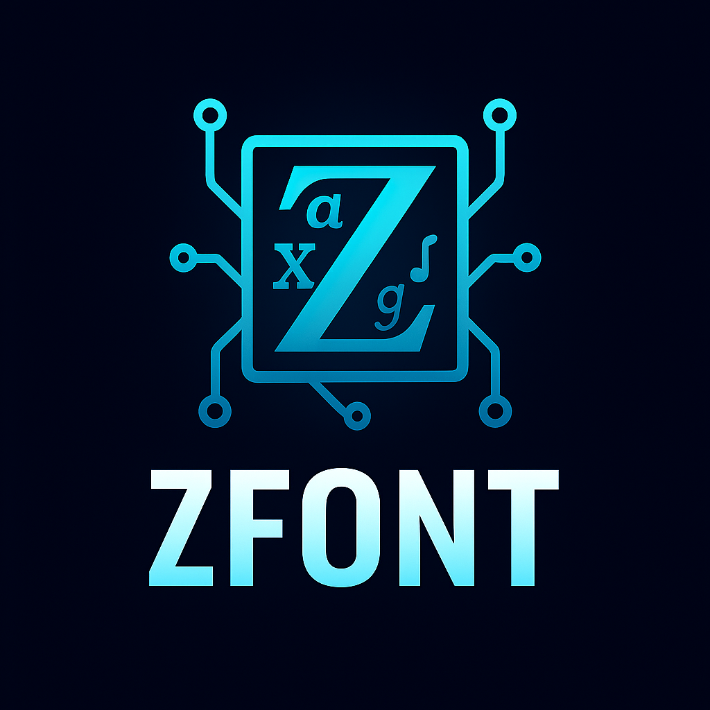

<div align="center">
  

  # ZFont

  [](https://ziglang.org)
  [](https://www.nerdfonts.com)
  [](https://github.com/tonsky/FiraCode)
  [](https://unicode.org)

## DISCLAIMER

⚠️ **EXPERIMENTAL LIBRARY - FOR LAB/PERSONAL USE** ⚠️

This is an experimental library under active development. It is
intended for research, learning, and personal projects. The API is subject
to change!

  **Modern Font Rendering Library for Zig**

  *Replacing FreeType, FontConfig, and Pango with pure Zig implementations*
</div>

## 🚀 Features

- **Font Loading & Rendering**: Complete TrueType/OpenType support
- **Text Layout Engine**: Advanced text shaping and layout capabilities
- **Emoji Support**: Full emoji rendering with intelligent fallback handling
- **Programming Fonts**: Native support for ligatures and coding-specific fonts
- **Nerd Fonts Integration**: Built-in support for icon fonts and developer symbols
- **Subpixel Rendering**: High-quality font rendering with hinting support
- **Unicode Compliant**: Full Unicode support for international text

## 🎯 Project Goals

ZFont aims to provide a complete font rendering solution by replacing traditional C libraries:

- **FreeType** → Pure Zig font loading and glyph rendering
- **FontConfig** → Native font discovery and management
- **Pango** → Advanced text layout and shaping

## 🛠️ Building

```bash
# Build the library and executable
zig build

# Run the demo application
zig build run

# Run tests
zig build test
```

## 📚 Usage

```zig
const std = @import("std");
const zfont = @import("zfont");

pub fn main() !void {
    var gpa = std.heap.GeneralPurposeAllocator(.{}){};
    defer _ = gpa.deinit();
    const allocator = gpa.allocator();

    // Initialize font manager
    var font_manager = zfont.FontManager.init(allocator);
    defer font_manager.deinit();

    // Set up text layout
    var layout = zfont.TextLayout.init(allocator);
    defer layout.deinit();

    // Emoji rendering
    var emoji_renderer = zfont.EmojiRenderer.init(allocator);
    defer emoji_renderer.deinit();

    const is_emoji = emoji_renderer.isEmoji(0x1F600); // 😀
    std.debug.print("Is emoji: {}\n", .{is_emoji});
}
```

## 🔧 Architecture

- **Font Manager**: Central font loading and caching system
- **Glyph Renderer**: Individual character rendering with hinting
- **Text Layout**: Complex text shaping and positioning
- **Text Shaper**: Advanced typography and ligature support
- **Emoji Renderer**: Dedicated emoji handling and fallbacks
- **Subpixel Renderer**: High-quality anti-aliasing
- **Programming Fonts**: Specialized support for developer fonts

## 🎨 Programming Font Support

ZFont includes native support for popular programming fonts:

- **Fira Code**: Complete ligature support
- **JetBrains Mono**: Developer-optimized rendering
- **Cascadia Code**: Microsoft's programming font
- **Source Code Pro**: Adobe's monospace font

## 🌟 Nerd Font Integration

Full compatibility with Nerd Fonts for developer icons and symbols:

- File type icons
- Git status indicators
- Programming language symbols
- System and tool icons

## 🤝 Related Projects

- [gcode](https://github.com/ghostkellz/gcode) - Unicode library for terminal semantics

## 📄 Development Status

ZFont is in active development. Current focus areas:

- Core font rendering engine
- Text layout and shaping
- Emoji fallback systems
- Programming font optimizations
- Performance benchmarking

---

<div align="center">
  <sub>Built with ⚡ in Zig</sub>
</div>