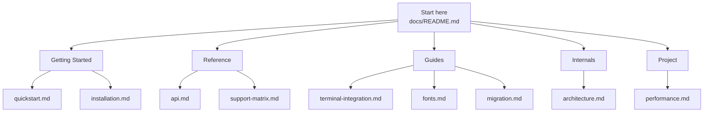
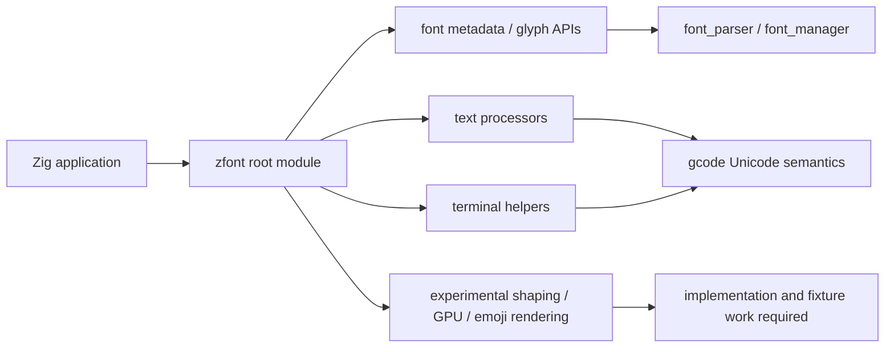
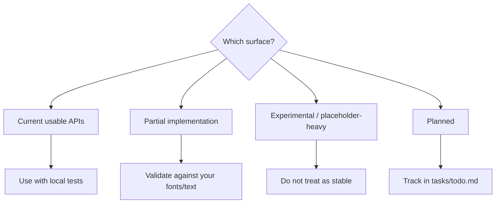

# ZFont Documentation

ZFont is an experimental Zig font and terminal text-processing library. The docs
are organized around the current implemented surface, clear experimental
boundaries, and the path toward a more complete pure-Zig font stack.

## Documentation Map



## Runtime Shape



## Stability Flow



## Getting Started

- [Installation](getting-started/installation.md) - Add ZFont as a Zig dependency and run local verification.
- [Quickstart](getting-started/quickstart.md) - Minimal examples for font manager and terminal text helpers.

## Reference

- [API Reference](reference/api.md) - Current exported API grouped by maturity.
- [Support Matrix](reference/support-matrix.md) - Implemented, partial, experimental, and planned surfaces.

## Guides

- [Terminal Integration](guides/terminal-integration.md) - Terminal text measurement, cursor movement, and gcode-backed semantics.
- [Font Catalog and Licensing](guides/fonts.md) - Recommended fonts and redistribution notes.
- [Migration Notes](guides/migration.md) - How to evaluate ZFont alongside HarfBuzz, ICU, FreeType, and FontConfig.

## Internals

- [Architecture](internals/architecture.md) - Module graph, data flow, and experimental boundaries.

## Project

- [Performance Evidence](project/performance.md) - Current benchmark posture and how future results should be recorded.

## Quick Links

| Area | Path |
|------|------|
| Package metadata | [`../build.zig.zon`](../build.zig.zon) |
| Build script | [`../build.zig`](../build.zig) |
| Root module | [`../src/root.zig`](../src/root.zig) |
| gcode dependency | [`../build.zig.zon`](../build.zig.zon) |
| Task backlog | `../tasks/todo.md` (local ignored task notes) |

## Verification

```bash
zig build
zig build test
```

ZFont is experimental. Treat claims as valid only when backed by current source,
tests, fixture fonts, and benchmark output from your target environment.
