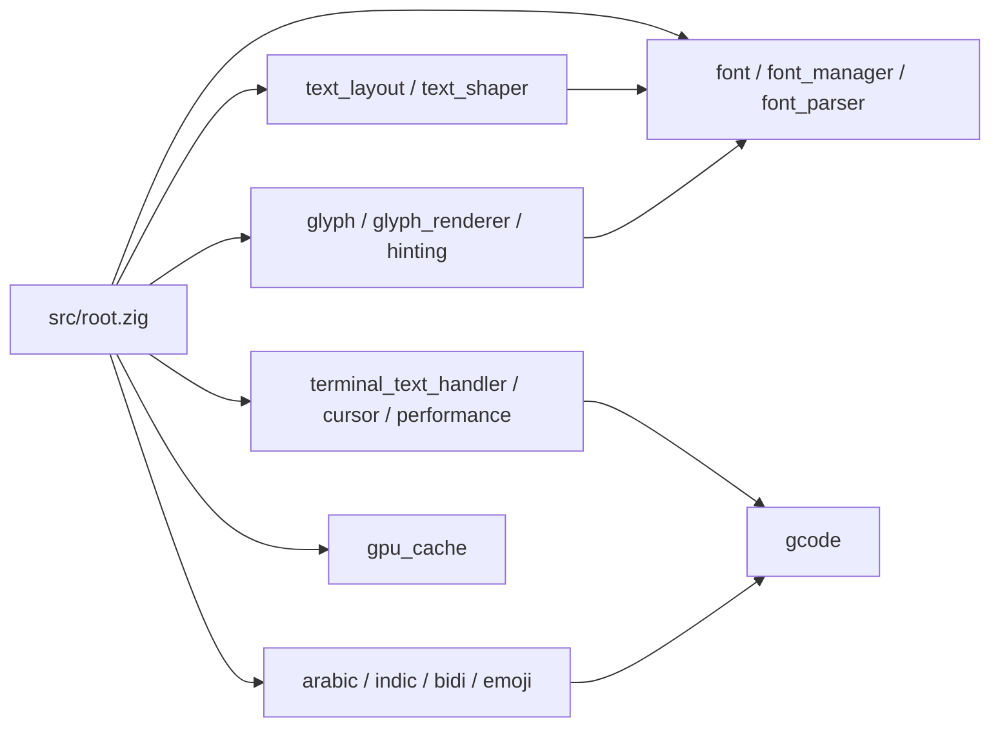
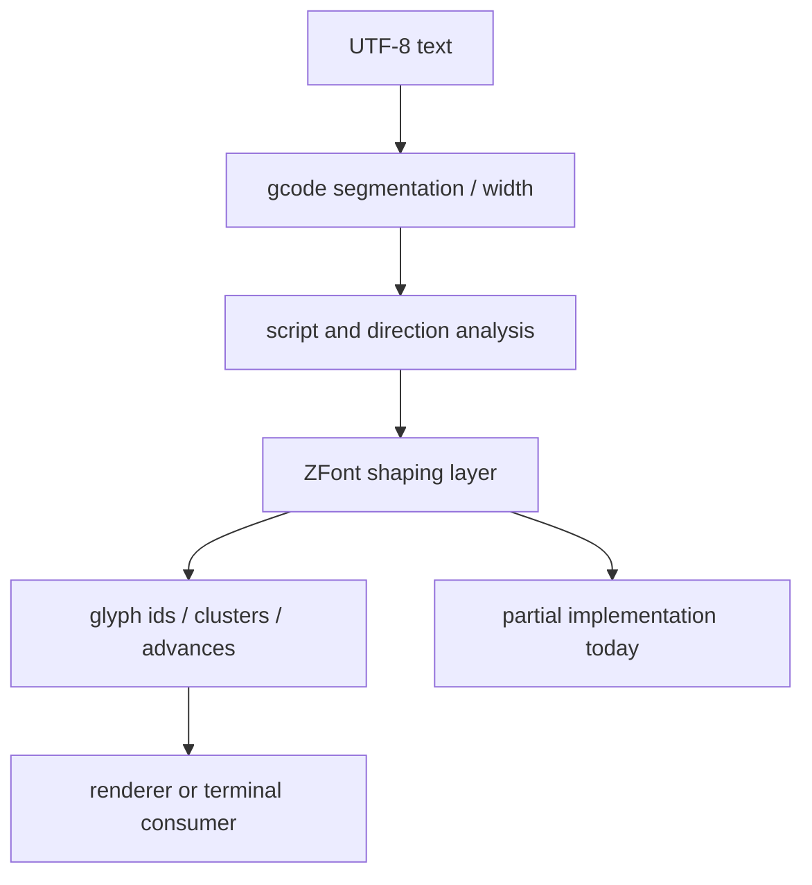
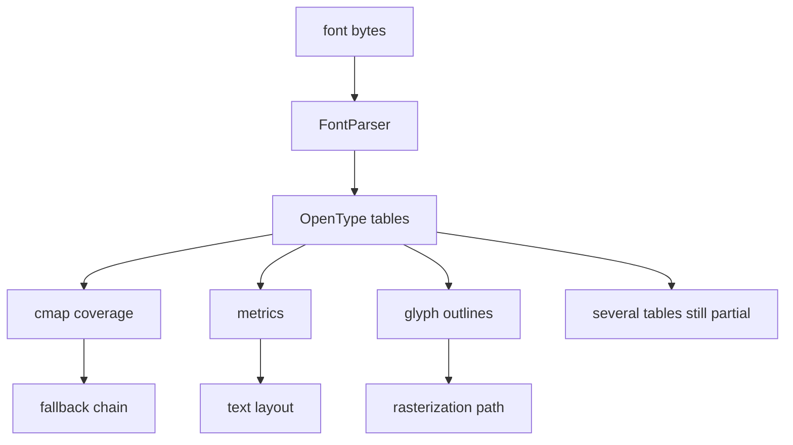

# Architecture

ZFont is organized as a pure-Zig font/text stack that delegates Unicode semantics
to gcode and keeps font parsing, layout, fallback, and rendering in this package.

## Module Shape

## Text Flow

## Font Flow

## Boundaries

- gcode owns Unicode property tables, segmentation, normalization, and terminal width policy.
- ZFont should own font file parsing, glyph lookup, fallback, shaping results, and rendering/rasterization.
- GPU and full shaping should remain experimental until real backends and fixture tests exist.
